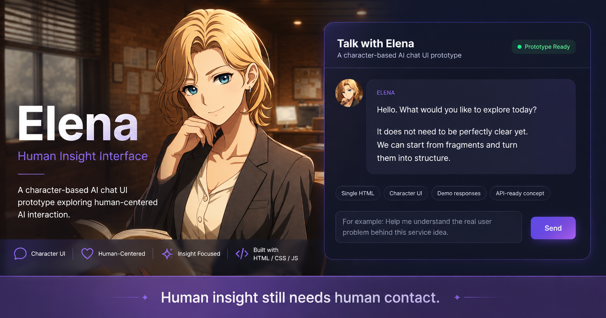
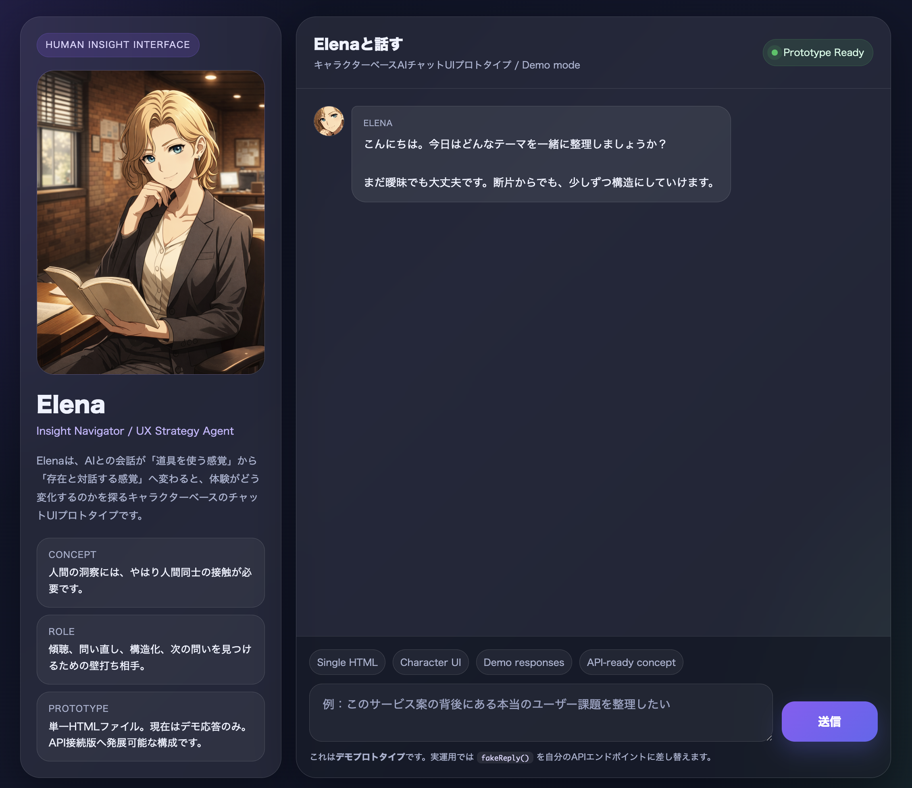

# Elena Chat UI Prototype



キャラクターベースのAIチャットUIプロトタイプです。

単なる「AIツール」ではなく、

> AIとの対話が、“存在との会話”に近づいたら何が変わるのか？

を探るために制作しました。

---

## Demo

GitHub Pages:

https://cv63kittyhawk.github.io/ux-agent-elena/

---

## コンセプト

AIインタビューやAIチャットは、効率よく情報収集できます。

ただ、その一方で気になっていることがあります。

人は、AI相手だと話し方が変わる。

- 理屈っぽくなる
- 感情を抑える
- 脱線しにくくなる
- 本音が出にくくなる

しかし実際の洞察は、

- 信頼関係
- 雑談
- 間
- 感情の揺れ
- 空気感

の中から出てくることも多い。

だから今回、

> 「AIが道具ではなく、キャラクターとして存在したら？」

という仮説から、小さなプロトタイプを作ってみました。

---

## Features

- 単一HTML構成
- キャラクターベースUI
- チャット形式インターフェース
- メッセージ内アバター表示
- レスポンシブ対応
- デモ応答システム
- API接続を想定した構造

---

## 使用技術

- HTML
- CSS
- Vanilla JavaScript
- GitHub Pages

フレームワーク無しで、軽量な試作として制作しています。

---

## Project Structure

```text
/
├── index.html
├── README.md
└── assets/
    ├── elena_ig.png
    └── ogp.png
```

---

## なぜ作ったか

今回の制作で強く感じたのは、

> AIは「全部やる」のではなく、
> 人間が止まらず前進できるようにする

という感覚でした。

普通なら、

- 面倒で止まる
- レイアウト調整で疲れる
- 実装前に諦める

ような部分を、
AIとの対話で前進し続けられた。

これは単なる効率化ではなく、

> “初動摩擦を減らす体験”

なのかもしれないと感じています。

---

## Future Plans

- OpenAI API連携
- リアルタイムキャラクターアニメーション
- 感情反映インタラクション
- 音声会話対応
- メモリ機能
- 複数キャラクターモード
- 表情変化システム

---

## Screenshot



---

## Author

Yutaka Morita

Exploring:
- UX
- AI
- Character Interaction
- Human-centered AI
- Interface Design

---

## License

MIT License
